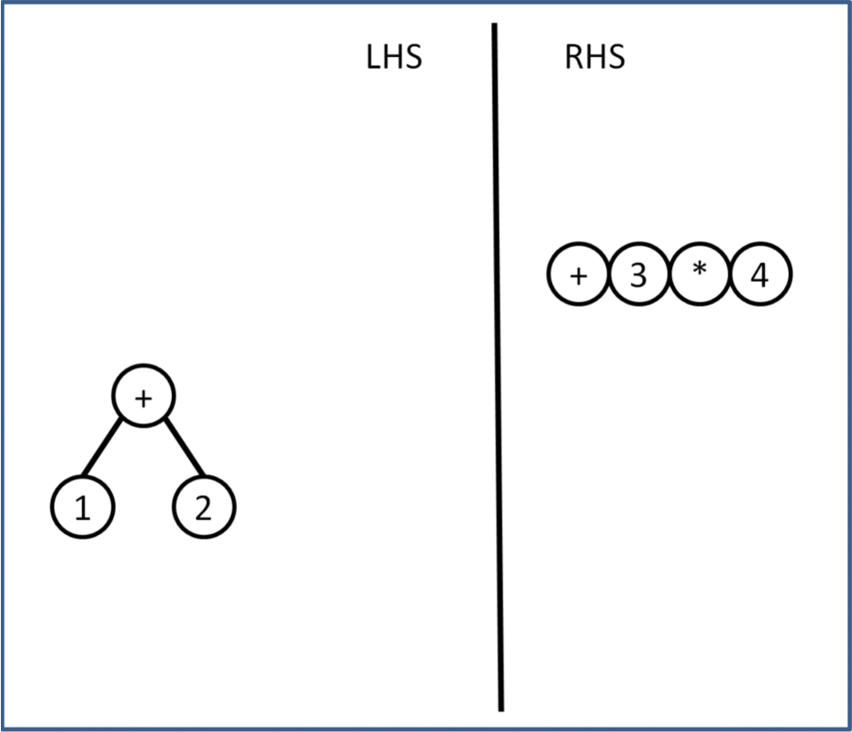

# Yay's Another Yacc 

Experimental parser generator

## Theory

The [Parsing Expression Grammer](https://en.wikipedia.org/wiki/Parsing_expression_grammar) makes it easy to declare a grammar. Unfortunately the implementations result in backtracking parsers, which are slow.  

We will attempt to make a parser that consumes one character at a time, in order; it will track the current set of matching patterns as it does so. The hope is that real-world programs written in real-world languages, do not experience a combinatorial explosion of possible expressions; making parsing much faster.

### Invariant

To help with coding, all parsing is done from left to right; we assume to have a parse tree on the left, and raw characters on the right of the current position. Recursive patterns will inspect all the nodes on the right most path the tree to find the correct insert point. This keeps the tree valid, even if incomplete. 

